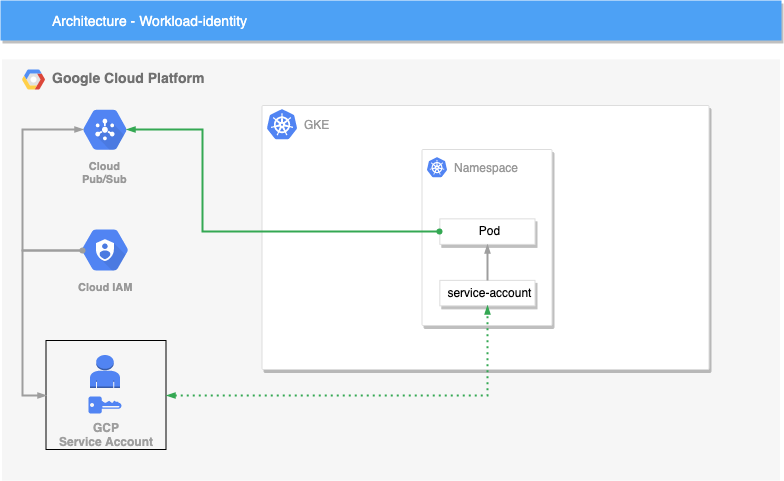

# Workload Identity Example

In this example we demonstrate how to create a Kubernetes cluster and to bind a GCP service account to a GKE service account giving your Kubernetes service account GCP level permissions.

## Introduction

What is [Workload Identity](https://cloud.google.com/kubernetes-engine/docs/how-to/workload-identity)?

Workload identity is a way to securely provide access to Google cloud services within your Kubernetes cluster.

This is accomplished by creating a Google cloud service account, then granting the roles and/or permissions required. Now you create a Kubernetes service account and you add the annotation to the service account referencing the GCP service account which has the required roles and/or permissions to be able to access the Google cloud services within your cluster.

## Example Architecture

The following diagrams will demonstrate workload identity and how it binds a GCP service account with Pub/Sub permissions to a GKE service account allowing the pod running your application to have the correct GCP permissions outside your Kubernetes cluster to access Pub/Sub correctly.



## Setup

In this repository there are several key things that must be mentioned.

Firstly, we've created a Google cloud service account for our terraform user which has access to create all the required resources within our Google project. This will need to be done before being able to use this repository. To be able to set this account up I'd highly recommend following the official Google documentation provided [HERE](https://cloud.google.com/community/tutorials/managing-gcp-projects-with-terraform).

Assuming you have your terraform service account setup correctly, you should now have the ability to run the `terraform init` command and it will create the relevant state file in your remote state location - ideally stored in Google cloud storage.

Note: Setting up the remote state should have been done as part of the Google documentation.

The following are some basic instructions to be able to create the terraform resources we've created in this project.

1. Update the [_backend.tf](_backend.tf) and [_providers.tf](_providers.tf) files and ensure the `credentials` location matches where you have stored your terraform service account json file.
2. Apply the terraform IaC to your Google cloud project using the following command:

```bash
$ terraform apply -auto-approve
```

Note: You may wish to first see what resources will be created in your project before applying this IaC, this can be done using the following command:

```bash
$ terraform plan
```

**Congratulations!** you have successfully started a Kubernetes cluster with workload identity working.

## Test

This will confirm that our GCP and GKE service accounts have been bound correctly and our GKE service account can indeed use IAM permissions bound to the GCP service account.

Firstly, you will need to authenticate your kubectl command, this can be done using the following commands:

```bash
$ gcloud auth login
$ gcloud container clusters get-credentials default-cluster
```

Run the following command in your termimal:

```bash
$ kubectl run -it \
  --generator=run-pod/v1 \
  --image google/cloud-sdk \
  --serviceaccount gke-sa \
  --namespace workload-identity \
  workload-identity-test
```

This will deploy a pod with a image that contains the google cloud SDK, it will use the GKE service account to deploy the pod - Once the pod is healthy it will become an intereractive shell that we can begin testing permissions from within the container running in the pod.

Once the shell is available you should be able to run the following command:

```bash
$ gcloud auth list
```

Running `gcloud auth list` will result in displaying the email addresses that can be used to auth. If this is successful you should see something like the following output in your terminal:

```bash
ACTIVE  ACCOUNT
*       gcp-sa@gke-terraform-cluster-demo.iam.gserviceaccount.com
```
